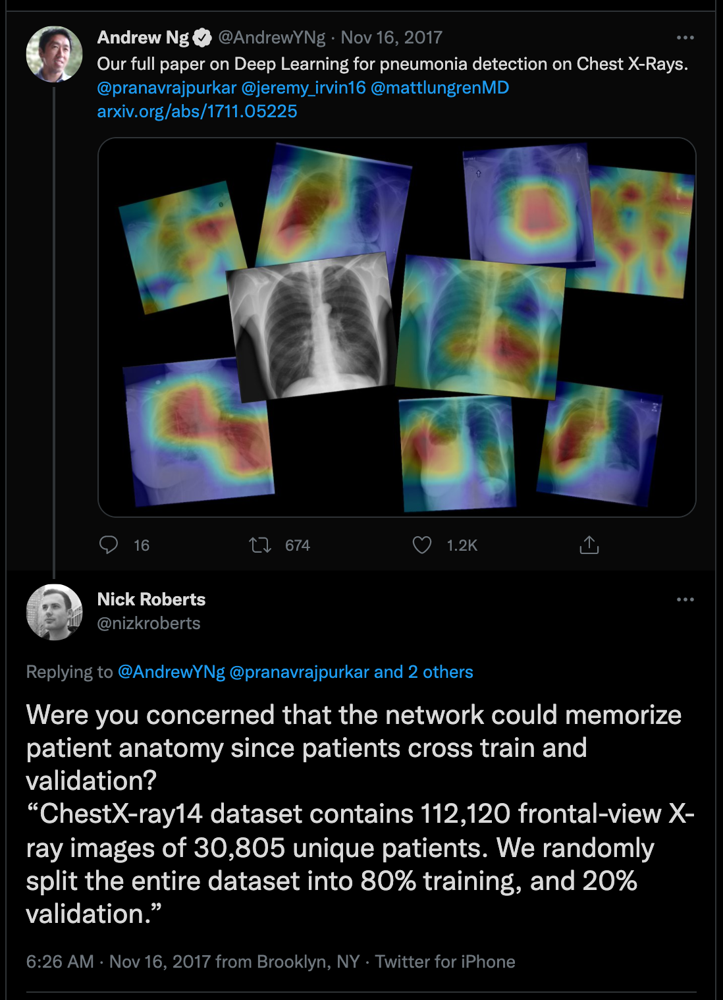

## Data leakage

Data leakage is the mistaken use of information in the model training process that in reality would not be available at prediction time. The result of data leakage is overly optimistic expectations and poor performance in out-of-sample datasets.

An extreme example of data leakage would be accidentally including a prediction target in a training dataset. In this case our model would perform very well on training data. The model would fail, however, when moved to a real-life setting where the outcome was not available at prediction time.

In most cases information leakage is much more subtle than including the outcome in the training data, and it may occur at many stages during the model training process. 

## Subset contamination

It is common to impute missing values, for example by replacing missing values with the mean or median. Similarly, data is often normalised by dividing through by the average or maximum. 

If these steps are done using the full dataset (i.e. the training and testing data), then information about the testing data will "leak" into the training data. The result is likely to be overoptimistic performance on the test set. For this reason, imputation and normalisation should be done on subsets independently.

Another issue that can lead to data leakage is to not account for grouping within a dataset when creating train-test splits. Let's say, for example, that we are trying to use chest x-rays to predict which patients have cardiac disease. If the same patient appears multiple times within our dataset and this patient appears in both our training and test set, this may be cause for concern.

{: width="600px"}

## Target leakage

In [Data Leakage in Health Outcomes Prediction With Machine Learning](https://www.jmir.org/2021/2/e10969/PDF) Chiavegatto Filho et al reflect [on a study](https://www.jmir.org/2018/1/e22/PDF) that describes a machine learning model for prediction of hypertension in patients using electronic health record data.

> The objective of the study was to “develop and validate prospectively a risk prediction model of incident essential hypertension within the following year.”  The authors follow good prediction protocols by applying a high-performing machine learning algorithm (XGBoost) and by validating the results on unseen data from the following year. The algorithm attained a very high area under the curve (AUC) value of 0.870 for incidence prediction of hypertension in the following year.

> The authors follow this impressive result by commenting on some of the most important predictive variables, such as demographic features, diagnosed chronic diseases, and mental illness. The ranking of the variables that were most important for the predictive performance of hypertension is included in a multimedia appendix; however, the above-mentioned variables are not listed near the top. Of the six most important variables, five were: lisinopril, hydrochlorothiazide, enalapril maleate, amlodipine besylate, and losartan potassium. All of these are popular antihypertensive drugs.

> By including the use of antihypertensive drugs as predictors for hypertension incidence in the following year, Dr Ye and colleagues’work opens the possibility that the machine learning algorithm will focus on predicting those already with hypertension but did not have this information on their medical record at baseline. ... just one variable (the use of a hypertension drug) is sufficient for physicians to infer the presence of hypertension.


